# Project Report

Author: Christof Karlin     161920910,
        Matthew Nitsopoulos 170673880,
        David Riolo         170718380

Date: 2021-04-10


## P2 System design & implementation
### P2.1 Client side component & UI

Our system uses HTML + CSS and Javascript on the front end, as well as php and mysql on the backend.

A user can either sign up and managage their own league or continue as guest when they land on the home page.
Depending if a user is logged in, the admin page will be visible or hidden.
When a user lands on the home page and has not previously selected a league from the list, the leaderboard, schedule and stats tabs will be hidden.
When a user selects a league from the table they will be redirected to that leagues leaderboard page.

{width=600px}

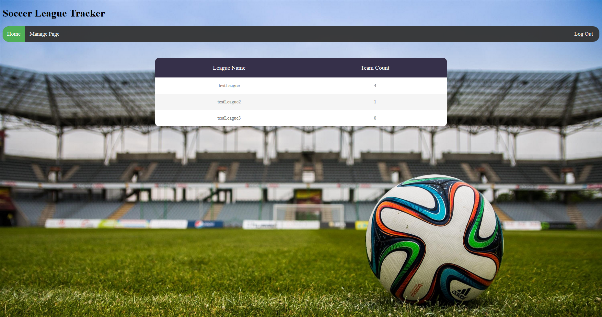{width=600px}

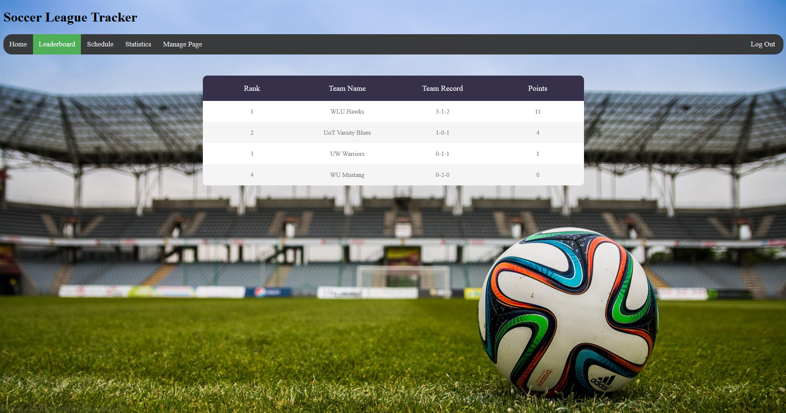{width=600px}


When the user selects the schedule tab from the navbar they will land on the schedule page. In this view the previously selected league\'s schedule will be shown in a table, sorted by date.
The user can click on any of the table headers and then the table will be sorted by that column (ASC and DESC).
Games not played will have a value `-` and played game will have its score show up (e.g. `2-3`)


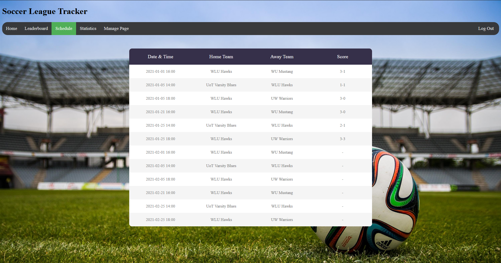{width=600px}

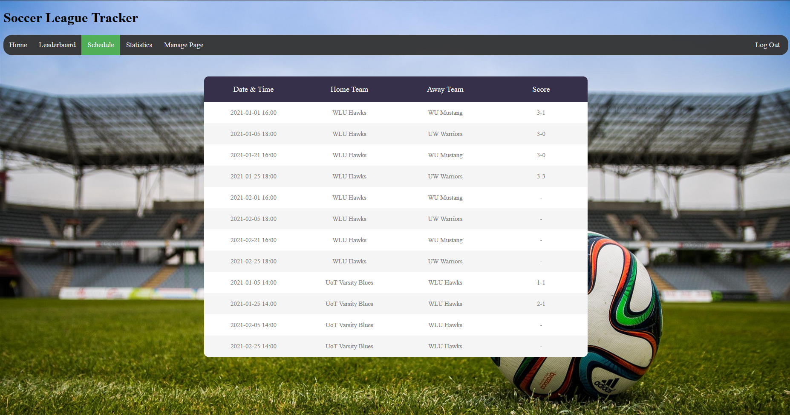{width=600px}

The stats page will orginally be sorted by Team id. by clicking any of the colomn headers you are able to sort ascending and descending. This allows to gain a good understanding of the league. Below you can see the order of team when you land on the page and the order after you sort by Goals For.

{width=600px}

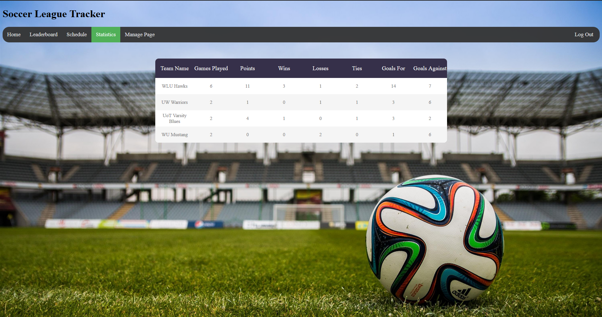{width=600px}


When a user logs in or clicks the Manage Page tab they are sent to the Admin page. 
When at this page they can choose a league if one exists under their account or they can add one by clicking the + button.
Once they select a league they have the option to add scores, schedule games and add teams to their league.
Once added, the information can be edited if a mistake was made or if changes need to be made.

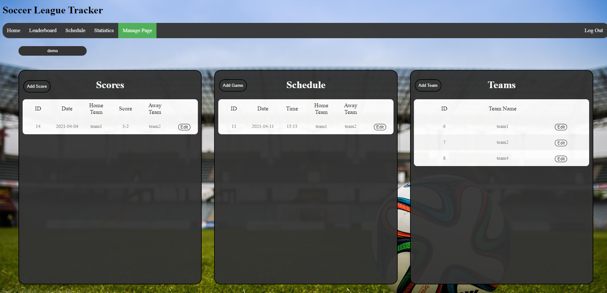{width=600px}

{width=600px}

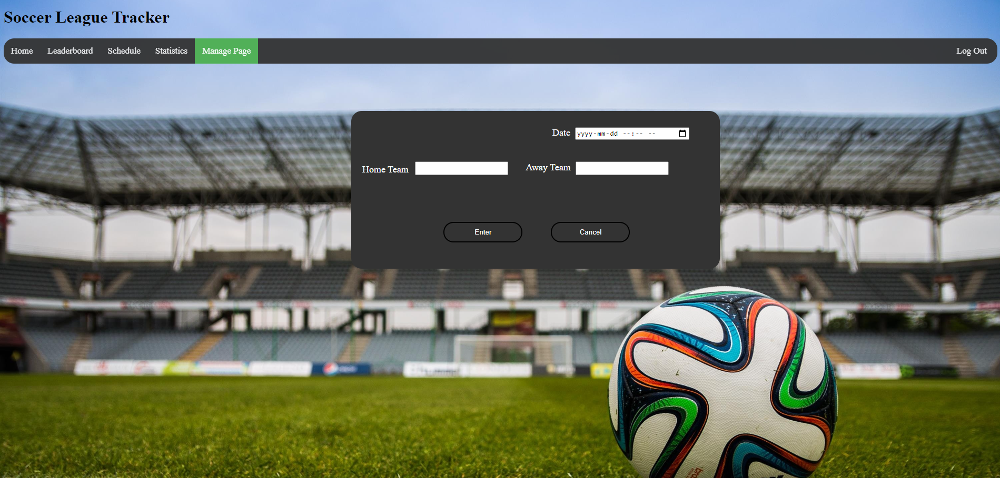{width=600px}

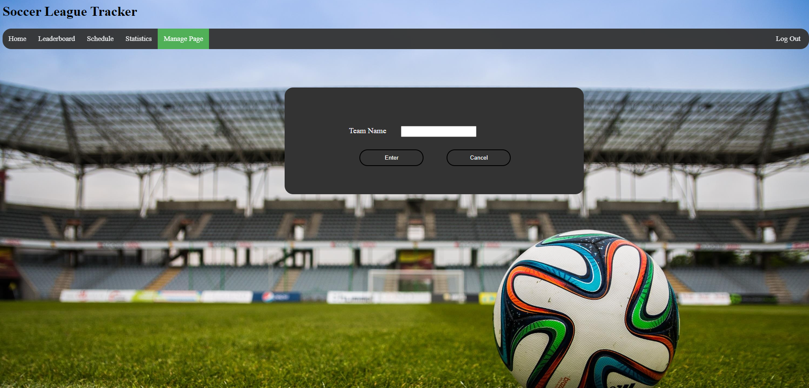{width=600px}

The user login page consists of two parts. The first part being the actual login form and the second being
the admin sign up form. Upon submitting either, you are sent to the Manage page.

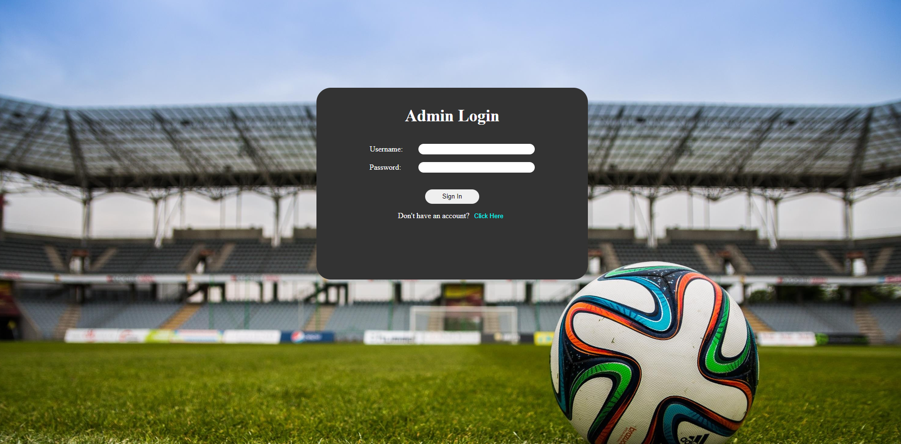{width=600px}

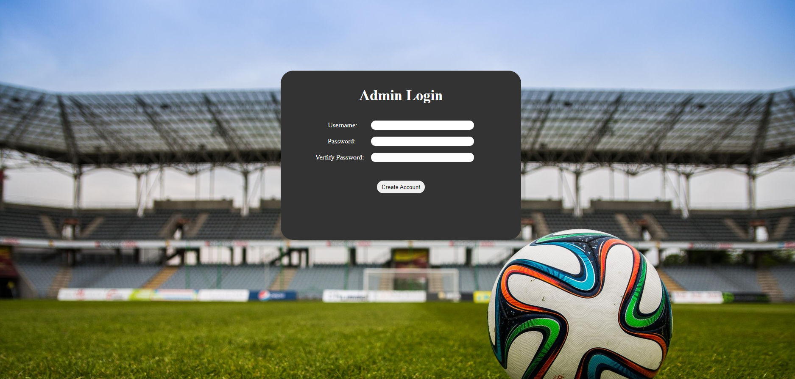{width=600px}


### P2.2 Server side CGI components

The Home page and schedule page make jQuery HTTP GET requests to the backend PHP file called `backendAPI.php`. 
This file has has 2 GET APIs: 
- `getLeagues` queries the `League` table and retrieves a list of all currently registered leagues
- `getSchedule` queries the `Game` table and retrieves the current schedule for the sent `leagueID` 

The Leaderboard, Statistics, Manage and Login pages all make JQuery HTTP POST requestes to the backend PHP file.
This requests return HTML data which is then dynamically added to the respective HTML page. These pages query
multiple tables to get all the required data to display for the user.


### P2.3 Database tier design, data, usage  

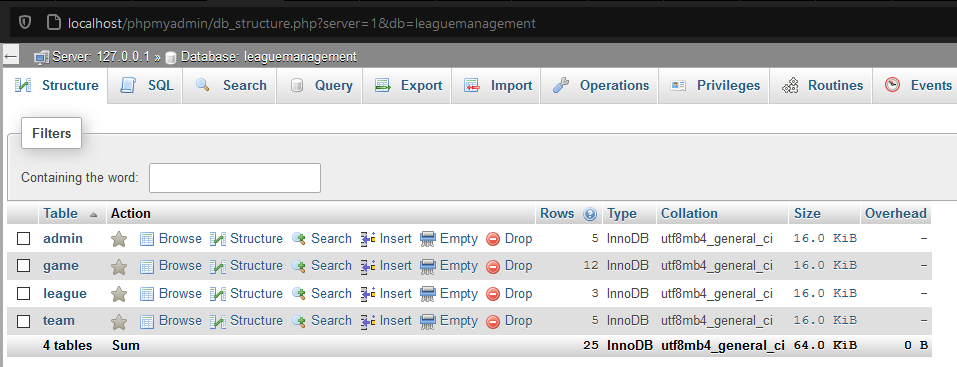{width=600px}

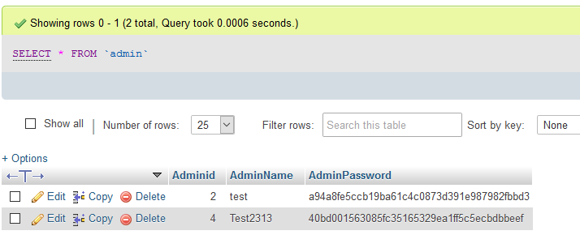{width=600px}

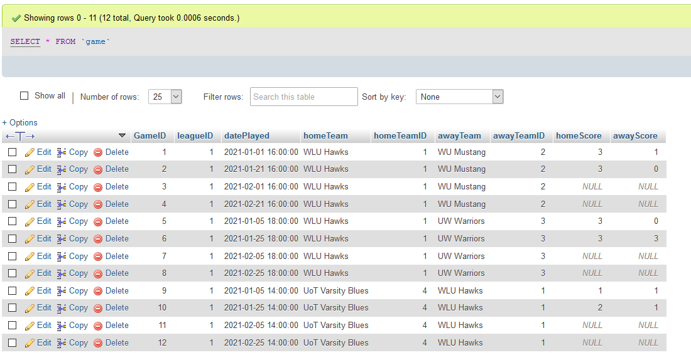{width=600px}

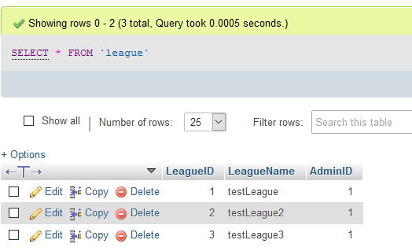{width=600px}

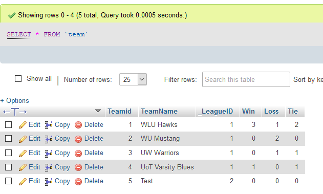{width=600px}

These databases are used when we query for data an example would be
```
SELECT * 
FROM Game 
WHERE leagueID = $leagueID 
ORDER BY datePlayed ASC
```

```
SELECT *, t.teamCount 
FROM League as l
LEFT JOIN
    (SELECT _LeagueID, count(*) as teamCount
        FROM Team
        GROUP BY _LeagueID) 
AS t ON t._LeagueID = l.LeagueID
```

```
SELECT * 
FROM team 
WHERE _LeagueID = $leagueID 
ORDER BY Win*2+Tie DESC"
```
```
UPDATE game 
SET homeTeam = 'hname', homeTeamID = 'homeID', awayTeam = 'aname', awayTeamID = 'awayID', datePlayed = 'gdate' 
WHERE GameID = 'gid'
```

```
INSERT INTO team(TeamName, _LeagueID, Win, Loss, Tie) 
VALUES (tname, leagueID, 0, 0, 0)
```


### P2.4 New features and tools

To keep track of what league was selected across different pages, we use a JavaScript property called Session Storage.
This allowed us to store a key, value pair across all of our webpages and have it be easily accessible when we needed 
to reference it. Thus when a league was selected, we would add the league to the session storage with the key `leagueID`
and then when we needed to load data on the statistics page or the schedule page, we would just call the Session Storage item
and use the data that gets returned with it.

We also used `JQuery` and `AJAX` to make all of our server requests. On top of that, we used some JQuery functions to dynamically alter our
HTML elements. For example, when a game or team is added or edited in the admin page, we remove all the rows in each table using the 
`.remove` method. This allowed us to clear the existing data and update the tables with the new data that was inputted.


### P2.5 Problem solving algorithms 
The Main problems we had to solve were:
- user-friendly UI
    - we created a user friendly, modern UI from scratch using just HTML, CSS and JavaScript
- data delivery from backend to front end
    - we use jQuery to make GET requests to our php backend that queries the database and send us back the data in JSON format
- saving data to backend
    - we use jQuery to make POST requests to our php backend that saves the data to our database
- user login with password encryption
    - upon users entering their password, we encrypt the password using SHA1 and compare it to the actual password in the database
    - all passwords are stored using a SHA1 encryption
- generating statistics from raw data
    - The statistics page was generated through sql querys. A simple query gave the results of Team name, Wins, Loss, and Tie. By adding another query you are able to find the value of 
    goals for by counting all home goals where the current team is the home team and summing that with the value of all away goals when the current team is the away team. Goals against was created is a similar by counting all goal the current team didnt score. Points was taken by multiplying Wins by 3 and adding Ties. Lastly games played was generated by summing the amuont of wins losses and ties.
    
{width=600px}  

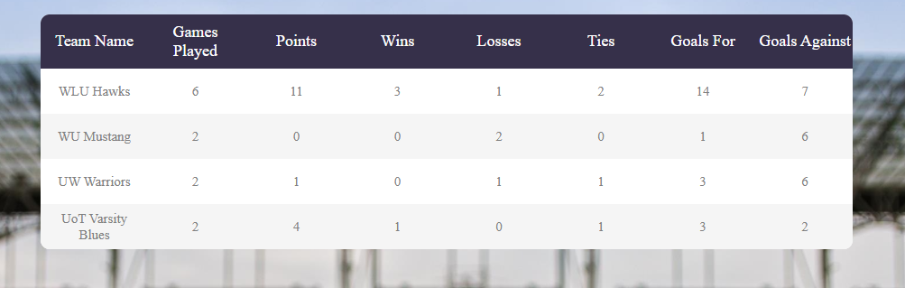{width=600px}  

### P2.6 Efficiency and robustness 
Since we are hosting the wep application and database locally (using XAMPP) there is virtually no loading delay. 
We dont allow admins to create teams, schedule games, or create past games if they have not created or selected a league yet.
To create a effecient program we have coded our HTML tables in such a way that they can be sorted using javascript so that the data in the tables only need to be quereied a single time. To fetch new data efficiently we only do so on page load. 

Error checking is done on both client side (checking session vars are set, user input is valid, etc. ) as well as in the backend (check values sent are set and correct format).


<!-- -> pic of alert when attemping to create a game with no league -->
{width=600px}

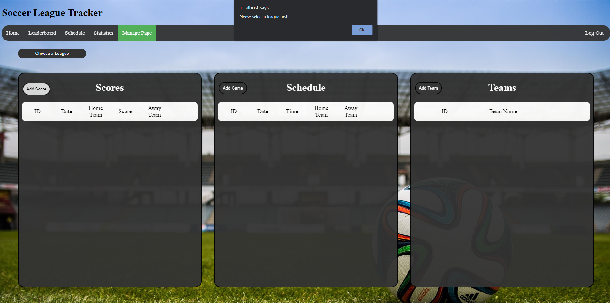{width=600px}

### Summary 
We can see from the screenshots above that we had achieved everything that we set out to do in our propsal.